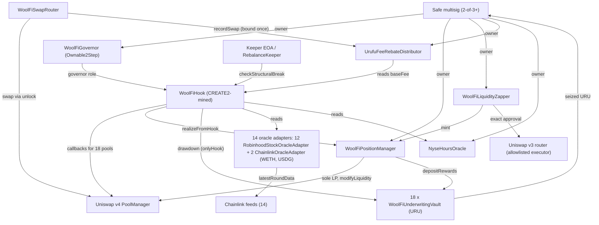

# Deployment Topology (post-deploy, Robinhood Chain 4663)

## Authorization edges

- Safe owns: governor (must call `acceptOwnership`), PM (constructor owner), zapper, rebate
  distributor, market-hours oracle.
- Governor holds the hook `governor` role (accepted during deploy).
- Hook is the only caller of each vault's `drawdown`; vault `rebalancer` (seized URU recipient)
  is immutable and set to the Safe.
- PM is the only allowed LP on WoolFi pools once wired (`UnauthorizedLiquidityProvider`).
- Router is bound once as the rebate distributor's recorder.
- Keeper and `checkStructuralBreak` are permissionless; the keeper holds no protocol funds.
